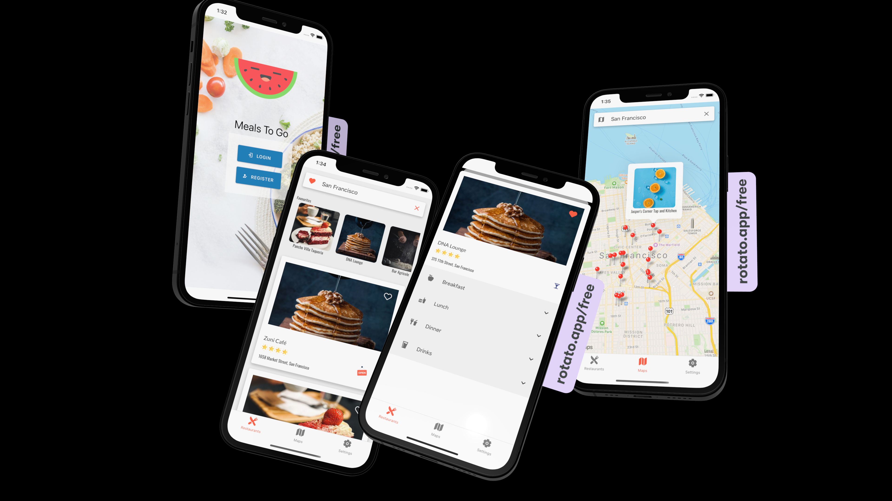

# Meals To Go Clone

A Zomato-esque clone made in React Native, where you can search for a city and see all the restaurants available in it, either in a list or a map view. You can go on to add them to favourites, and view favourites in a Horizontal Carousal or a favourites list in your profile section, or browse the menus available for the restaurants. The login and registration is handled through Firebase auth, and profile settings are persisted through Async Storage.
